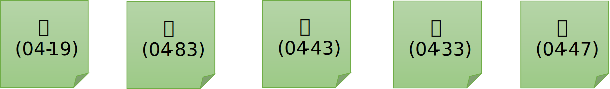
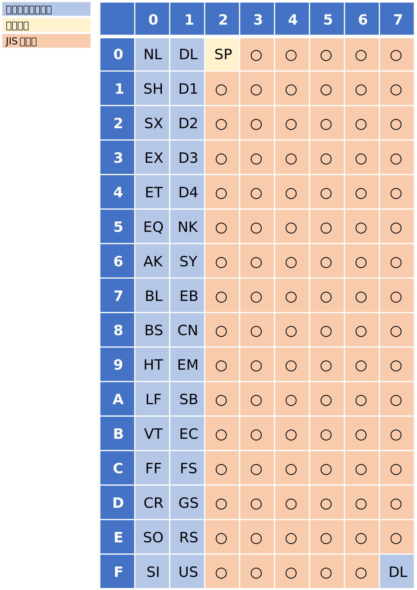
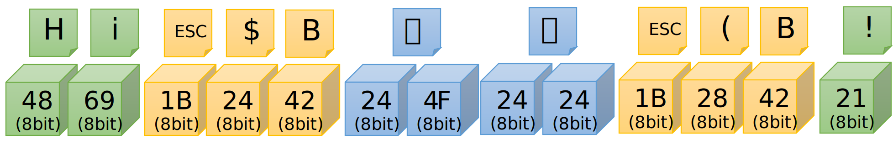
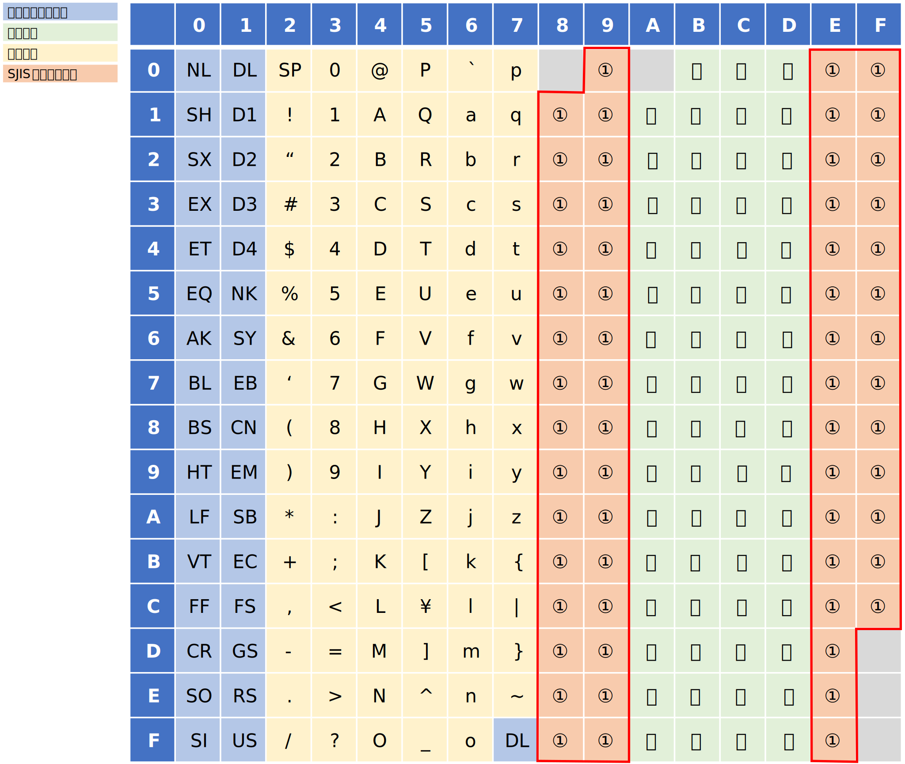
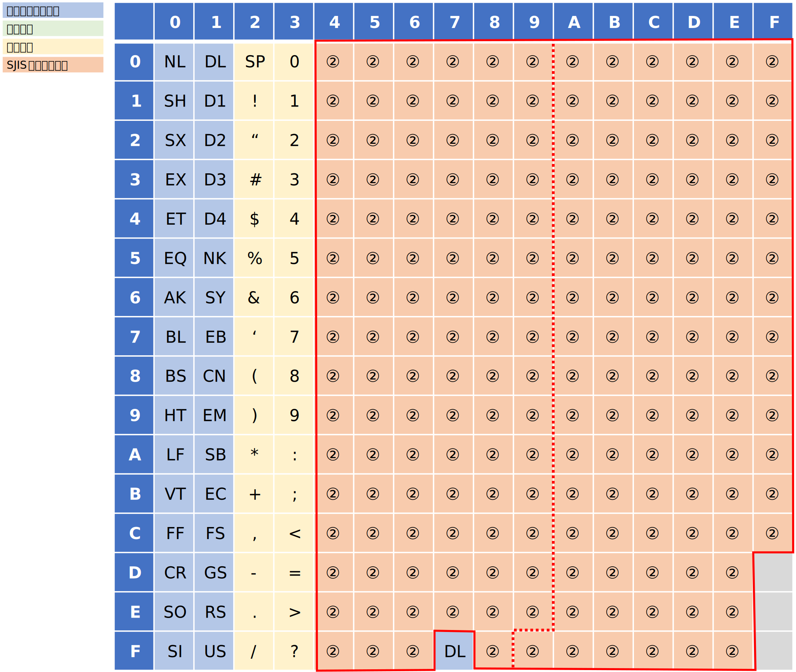

# はじめに

Unicode が登場する以前、日本では以下の文字コードがよく使用されていました。これ以外にも  EBCDIC などがありますが、ここではメジャーな以下の３つを取り扱いします。

| 文字コード | 説明 | 
|------|------|
| JIS (ISO-2022-jp) | メール等の伝送形式として広く利用 |
| SJIS (Shift-JIS)  | Windows OS で主に利用            |
| EUC (EUC-JP)      | Unix で主に利用（当時）          |

※以降の説明では、原則的に JIS, SJIS, EUC と表記します。

Unicode は世界中の文字を単一の文字集合として扱っている文字集合の規格でもあり、同時に符号化方式の規格でもあります。一方で JIS, SJIS, EUC は、符号化方式の規格でであり、文字集合としては別の規格（JIS X 0208 や JIS X 0201 など）で定義されます。
ここでは、JIS,SJIS,EUC の関係と符号化方式について取り扱います。

なお、Unicode と JIS,SJIS,EUC-JP は扱っている文字の集合が異なるので、採番されているコードポイントは全く違う体系になっています。
この為、Unicode ⇔ JIS, SJIS, EUC 間の変換には「変換表」が必要で、単純な計算で変換することができませんので、Unicode との変換方法についてはここでは取り扱いません。

# 符号化文字集合

JIS, SJIS, EUC は、符号化方式、あるいは、符号化した結果の文字コードを表す用語ですが「符号化文字集合」の規格ではありません。

JIS, SJIS, EUC は、符号化文字集合としては、JIS X 0208, JIS X 0201 などの規格で定義されている文字集合を扱います。
JIS X 0208 などで定義されるコードポイント（区点位置）は、94 個の「区」と 94 個の「点」で定義されています。
例えば「こんにちは」の各文字のコードポイントは、以下になります。括弧内は、区点（区-点）を表しています。数字は10進数です。



※ なお、最新の規格では、字がさらに追加されており、現在は "面" が追加されて「面」-「区」-「点」で定義されていますが、本記事では扱っていませんのでご注意ください

# 文字符号化形式と文字符号化スキーム

JIS, SJIS, EUC は符号化の方式を表す用語です。
Unicode では「文字符号化形式」と「文字符号化スキーム」を区別しないと混乱しますが、JIS, SJIS, EUC の場合はあまり区別していない方が多いかと思います。
もちろん概念的には区別できますが、JIS, SJIS, EUC のいずれも BYTE(8bit) の箱に符号化する方式の為、現実問題としてあまり区別する必要がない為です。

# JIS (ISO-2022-JP)
JIS (ISO-2022-JP) は、区点で表現されるコードポイントを、それぞれ 0x21～0x7E の範囲に収まるように採番するエンコードする方式です。

なお、第一バイト目も第二バイト目も 0x21～0x7E の範囲内になるので第 8bit は 0 になります。つまり 7bit の配列で表現することができます。

## JIS のエンコーディング
コードポイント（区点位置）を JIS コードに変換するには、「区」を、第一バイト目の 0x21～0x7E に割り当て、「点」を、第二バイト目の 0x21～0x7E に割り当てることで、結果的に２バイトの箱にエンコードします。
例えば 04区19点の「こ」という字は、

 | 04(10進) + 0x20 = 0x24 |
 | 19(10進) + 0x20 = 0x33 | 

となり、0x2433 が該当する JIS コードになります。

なお、JIS コードの取りうる範囲を ASCII 表で見てみると次のようになります。○の部分（オレンジの部分）に JIS の第一バイトと第二バイトがレイアウトされます。コントロール文字を避けており、かつ、7bit に収まっているのが見て取れると思います。



## 半角英数字（ASCII) の変換
英数字のコードポイントは 7bit 以下のエリアにレイアウトされていますので、そのまま（変換なしに）JIS コードになります。

## 半角カナの変換
半角カナのコードポイントも 7bit 以下のエリアにレイアウトされていますので、そのまま（変換なしに）JIS コードになります。

## エスケープシーケンス
さて、先述の方法で JIS コードに符号化すると、JIS コードの第一バイトと第二バイトはすべて 0x7E 以下になります。また、半角カナも半角英数字も 7bit 文字です。つまり、半角カナや半角英数字のコードと混在すると、どちらの文字か区別がつかなくなることに気づくと思います。

この問題を解決する為に、各文字集合へ切り替わる前に、特別な文字の並び（エスケープシーケンス）を挿入して、文字種を区別できるようにします。例えば、全角文字の前には 0x1B, 0x24, 0x42 という並びを、半角文字の前には 0x1B, 0x28, 0x42 という並びを挿入します。以下に例を示します。

「Hiはい!」という半角全角混在の文字列を JIS コードで表現する場合：



エスケープシーケンスは、符号化文字集合を切り替える為に使用される為、符号化文字集合ごとに決められています。

| 符号化文字集合  | 	文字種類         | 	１６進表現        | 	文字列表現 |
|-----------------|--------------------------|---------------------------|--------------------|
| JIS C 6226-1978 | 第1・第2水準漢字	 | 1B 24 40	          | ESC $ @            |
| JIS X 0208-1983 | 第1・第2水準漢字	 | 1B 24 42	          | ESC $ B            |
| JIS X 0208-1990 | 第1・第2水準漢字	 | 1B 26 40 1B 24 42	 | ESC & @ ESC $ B    |
| JIS X 0212-1990 | 補助漢字	         | 1B 24 28 44	       | ESC $ ( D          |
| JIS X 0201      | 半角英数	         | 1B 28 4A	          | ESC ( J            |
| JIS X 0201      | 半角カナ	         | 1B 28 49	          | ESC ( I            |
| ISO/IEC 646     | ASCII                    | 1B 28 42	          | ESC ( B            |

# SJIS (Shift-JIS)
Shift-JIS は、エスケープシーケンスを用いずに全角文字と半角カナや半角英数字が混在できるようにする為に考案された符号化方式です。
Shift-JIS の名前は、JIS コードをシフト（ずらして）して作られていることに由来しています。
各文字を混在させるために少し複雑な符号化方式になっています。Windows OS で広く使用されていました。

## SJIS のエンコーディング
コードポイントから Shift-JIS を算出する方法については省略します。代わりに、変換については JIS コードから変換する方法を参照してください。

## 半角英数（ASCII）の変換
英数字に関しては、JIS コードと全く同じコードを使用します（つまり変換なし）

## 半角カナの変換
SJIS の半角カナは、JIS コードの半角カナに、第８ビットをオンにして算出します。変換のアルゴリズムを C の疑似コードで示します。

``` c
// JIS --> SJIS
int jh2sh(const int h) { return h | 0x80; }
// SJIS --> JIS
int sh2jh(const int h) { return h & 0x7F; }
```

## JIS ⇔ SJIS

JIS と SJIS の変換は若干複雑です。以下に概要を説明します。

■変換概要
 - JIS コードの第一バイト目を 0x81～0x9F, 0xE0～0xFC の間に収まるようにシフトする（図の①の部分に収まるように）




 - JIS コードの第二バイト目を 0x40～0xFC に収まるようにシフトする。ただし、0x7F は DEL 文字（コントロール文字）なので、0x7F を避けるようにシフトする（図の②の部分に収まるように）

   + 第一バイトが奇数の時は第二バイトを 0x40～0x9E の範囲にシフト
   + 第一バイトが偶数の時は第二バイトを 0x9F～0xFC の範囲にシフト   



■STEP1: 変換概要

JIS の第一バイトと第二バイトはそれぞれ 0x21～0x7E の範囲にあるので 94 通りのパターンがあります。
しかし変換後は、0x81～0x9F, 0xE0～0xFC （計60通り）の範囲に収めなければなりません。
当然、そのままでは入りきりません。そこで第一バイト目が偶数の時と奇数の時に場合分けを行います。
こうすることで第一バイトを 94 通りから、半分の 47 通りに減らすことができます。
第一バイト目で失われた情報（偶数奇数で分けた為）は、第二バイト目に含める必要があります。
具体的には第一バイト目が奇数か偶数かによって、第二バイト目の範囲を変更することで対応します。

■STEP2: 第一バイト目を求める
半分に減らした第一バイトを、0x81～0x9F, 0xE0～0xFC の範囲に収める為には次のような演算を行います。
次は C の疑似コードで、j1 を変換対象の JIS 第一バイト目とし、s1 が SJIS の第一バイト目（結果）とします。

``` c
// ① まず、計算の都合上 j1 から 0x21 を引いて、j1 が 0x00 ～ 0x5D の範囲に収まるようにします。
j1_1 = j1 - 0x21;
// ②次に上位 7 ビットを取得します。なお、計算機に詳しい方はご存じだと思いますが、これは整数 j1 を 2 で割る（半分にする）ことと同義です
j1_2 = (j1_1 >> 1);
// ③ 演算結果を 0x81～0x9F, 0xE0～0xFC に収まるようにシフトします
if ( j1_2 <= 0x1E ) {
  s1 = j1_2 + 0x81
} else {
  s1 = j1_2 + 0xC1
}
```

■STEP3: 第二バイト目を求める

第一バイトが偶数の時は第二バイトを 0x9F～0xFC（計94通り）の範囲にシフトし、第一バイトが奇数の時は 0x40～0x9E（0x7F を除いて計94通り）の範囲にシフトします。注意点としては、0x7F がコントロール文字なので、0x7F は避ける必要があります。
具体的なアルゴリズムを C の疑似プログラムで示します。j2 を JIS の第二バイト目、s2 が SJIS の第二バイト目（結果）とします。

``` c
if( j1 & 1 ) {  // 奇数の判定
  s2 = j2  + ((j2 >= 0x60) ? 0x20 : 0x1F);    // 0x7F を避けてシフトする。
} else {
  s2 = j2  + 0x7E;
}
```

■まとめると

上述の内容をすべてまとめて、かつ、若干式変形（最初に 0x21 を引くのを省略してあとから辻褄合わせしている）したものが以下です。C の疑似コードで示します。

``` c
// JIS -> SJS 変換
void j2s(const int j1, const int j2, int& s1, int& s2) {
  if( j1 & 1 ) {  // 奇数の判定
    s1 = (j1>>1) + ((j1 >  0x5D) ? 0xB1 : 0x71);
    s2 = j2  + ((j2 >= 0x60) ? 0x20 : 0x1F);
  } else {
    s1 = (j1>>1) + ((j1 >  0x5E) ? 0xB0 : 0x70);
    s2 = j2  + 0x7E;
  }
}
```

また、逆変換は以下の様になります。

``` c
// SJIS -> JIS 変換
void s2j(const int s1, const int s2, int& j1, int& j2) {
  if( s2 < 0x9F ) {
    j1 = (s1<<1) - ((s1 >= 0xE0) ? 0x161 : 0xE1);
    j2 = s2  - ((s2 > 0x7F)  ? 0x20 : 0x1F);
  } else {
    j1 = (s1<<1) - ((s1 >= 0xE0) ? 0x160 : 0xE0);
    j2 = s2  - 0x7E;
  }
}
```


# EUC（EUC-JP）
EUC (EUC-JP) は、区点で表現されるコードポイントを それぞれ 0xA1～0xFE の範囲に収まるように採番するエンコードする方式です。
第一バイト目も第二バイト目も、第 8bit が１になる為、半角英数との混在が容易です。この為、全角文字と半角英数に関しては非常にシンプルな符号化方式ですが、半角カナの混在には工夫が必要になります。
なお、EUC は一昔前の UNIX で広く使われていたコードです。日本語以外のバージョンもある為、区別する為に -JP を付けることが多いです。

## EUC のエンコーディング
コードポイント（区点位置）を EUC コードに変換するには、「区」を、第一バイト目の 0xA1～0xFE に割り当て、「点」を、第二バイト目の 0xA1～0xFE に割り当てることで、結果的に２バイトの箱にエンコードします。
例えば 04区19点の「こ」という字は、

 | 04(10進) + 0xA0 = 0xA4 |
 | 19(10進) + 0xA0 = 0xB3 |

となり、0xA4B3 が該当する EUC コードになります。

なお、EUC コードの取りうる範囲を ASCII 表で見てみると次のようになります。○の部分（オレンジの部分）に EUC の第一バイトと第二バイトがレイアウトされます。これにより半角英数とは競合しないことが見て取れると思います。


 - ※SS2 は Single Shift 2 の略で、SS2 に続けて現れる都合２バイトで半角カナを表す
 - ※SS3 は Single Shift 3 の略で、SS3 に続けて現れる都合３バイトで補助漢字や外字を表現することができる

## 半角英数（ASCII）の変換
英数字に関しては、JIS コードと全く同じコードを使用します（つまり変換なし）

## 半角カナの変換
EUC の半角カナは、0x8E (SS2) を第一バイト目として、第二バイト目は JIS コードの半角カナに第８ビットをオンにして算出します。つまり2バイト文字になります（"半角" ですが２バイトです）。
変換のアルゴリズムを C/C++ の疑似コードで示します。

``` c
// JIS 半角 -> EUC 半角 (EUC の半角は先行する 0x8E(SS2) に続く２バイト文字）
//
// （参考）利用するには例えば以下の様にする
// char jis_str[] = { 0xXX, 0xXX, ........ };  // 変換対象の JIS 文字列
// int euc_ch = sh2eh( jis_str[ N ] );  // N バイト目を変換
// char euc_str[] = { ((euc_ch >> 8) & 0xFF), (euc_ch & 0xFF) /*, 0x00 */ }; 
//
int jh2eh(const int h) {
  return h | 0x8E80;  // 上位バイトに 0x8E を追加して、かつ、第８ビットを立てる
}
```

``` c
// EUC 半角 -> JIS 半角
//
// （参考）利用するには例えば以下の様にする
// char euc_str[] = { 0xXX, 0xXX, ........ };  // 変換対象の EUC の文字列
// int jis_ch = jh2eh( (euc_str[ N ] << 8) | euc_str[ N+1 ] ); // N バイト目を変換
// char jis_str[] = { jis_ch /*, 0x00 */ };  // なお、文字集合が変わるポイントの時は先行してエスケープシーケンスを入れること
//
int eh2jh(const int h) {
  return h & 0x007F; // 下位１バイトを取り出して、かつ、第８ビットを落とす
}

参考までに SJIS の半角カナとの変換は以下のようになります。

``` c
// SJIS 半角 -> EUC 半角 (EUC の半角は先行する 0x8E(SS2) に続く２バイト文字）
//
// （参考）利用するには例えば以下の様にする
// char sjis_str[] = { 0xXX, 0xXX, ........ };  // 変換対象の SJIS 文字列
// int euc_ch = sh2eh( sjis_str[ N ] );  // N バイト目を変換
// char euc_str[] = { ((euc_ch >> 8) & 0xFF), (euc_ch & 0xFF) /*, 0x00 */ };
//
int sh2eh(const int h) {
  return h | 0x8E00;  // 上位バイトに 0x8E を追加して、下位バイトはそのまま
}
```

``` c
// EUC 半角 -> SJIS 半角 (EUC の半角は先行する 0x8E(SS2) に続く２バイト文字）
//
// （参考）利用するには例えば以下の様にする
// char euc_str[] = { 0xXX, 0xXX, ........ };  // 変換対象の EUC の文字列
// int sjis_ch = eh2sh( (euc_str[ N ] << 8) | euc_str[ N+1 ] );  // N バイト目を変換
// char sjis_str[] = { sjis_ch /*, 0x00 */ };
//
int eh2sh(const int h) {
  return h & 0x00FF  // 下位バイトのみ取り出し
}
```

## JIS ⇔ EUC 変換

これまでの説明を読めば、あまり説明は必要ないと思いますので、アルゴリズムを C の疑似コードで示します。

``` c
// EUC -> JIS
void e2j(const int e1, const int e2, int& j1, int& j2) {
  j1 = e1 & 0x7F;
  j2 = e2 & 0x7F;
}
```

``` c
// JIS -> EUC
void j2e(const int j1, const int j2, int& e1, int& e2) {
  e1 = j1 | 0x80;
  e2 = j2 | 0x80;
}
```

## SJIS ⇔ EUC 変換
これまでの説明を読めば、あまり説明は必要ないと思いますので、アルゴリズムを C の疑似コードで示します。

``` c
// EUC -> SJIS
void e2s(const int e1, const int e2, int& s1, int& s2) {
  if(e1 & 1){
    s1 = (e1>>1) + ((e1 > 0xDD)  ? 0x71 : 0x31);
    s2 = e2  - ((e2 >= 0xE0) ? 0x60 : 0x61);
  } else {
    s1 = (e1>>1) + ((e1 > 0xDE)  ? 0x70 : 0x30);
    s2 = e2 - 2;
  }
}
```

``` c
// SJIS -> EUC
void s2e(const int s1, const int s2, int& e1, int& e2) {
  if(s2 < 0x9F){
    e1 = (s1<<1) - ((s1 >= 0xE0) ? 0xE1 : 0x61);
    e2 = s2  + ((s2 >  0x7F) ? 0x60 : 0x61);
  } else {
    e1 = (s1<<1) - ((s1 >= 0xE0) ? 0xE0 : 0x60);
    e2 = s2  + 2;
  }
}
```
