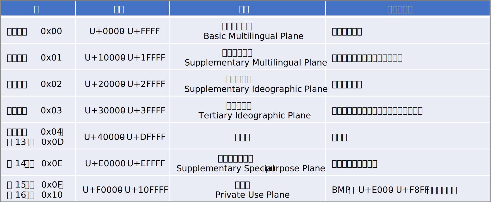
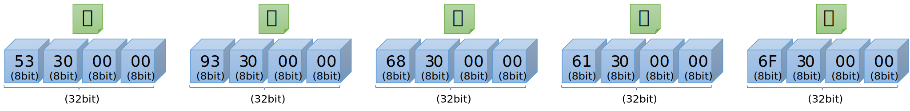
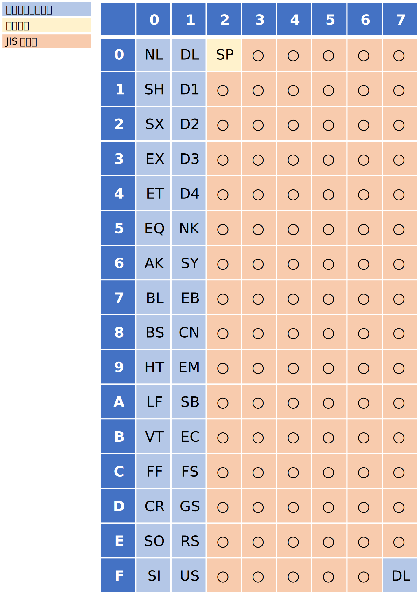
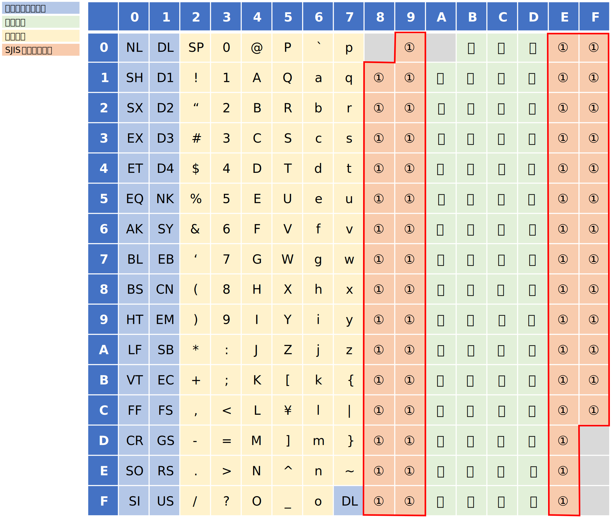

# はじめに
本記事では Unicode と JIS/SJIS/EUC について、それぞれのエンコーディング方法について記述しています。
Unicode の情報は多いですが、JIS/SJIS/EUC などの文字コードに関する情報は減ってきていますので参考なれば幸いです。
元の記事は 2000 年代に書いたものですがブログの記事数を稼ぐため若干内容を更新して掲載しました。

# 術語の整理

Unicode は符号化文字集合や文字符号化方式などを定めた業界規格です。Unicode は符号化文字集合の規格でもあり、符号化方式（CEF, CES）の規格でもあります。
Unicode は世界中の文字を単一の文字集合（文字セット）として扱っているいるところが特徴です。

文字コードとその周辺の知識を理解する為には、「アルファベット」「ひらがな」「カタカナ」などの文字集合が、計算機上で符号化されて文字コードとして表現されるまでに三段階のレベルがあることを最初に理解します。


## 抽象文字集合（ＡＣＲ）
 - 単純な文字の集合

「抽象文字集合」あるいは単に「文字集合（文字セット）」は、その名の通り、文字の集合を指します。とくに難しい概念ではありません。「アルファベット」も「５０音」も文字集合の一種です。

## 符号化文字集合（ＣＣＳ）

 - ひとつひとつの文字を区別できるようにする為に、文字にユニークな番号を採番した文字集合

前述の抽象文字集合はあくまで文字の「集まり」を指しているだけです。
計算機で文字を扱うには、文字を区別する為に、文字にユニークな番号が採番されていないと不便です。
ちょうど学校のクラスで生徒に出席番号を振るのと同じように、一つ一つの文字にもユニークな番号を採番します。
各文字にユニークな番号を採番した文字集合のことを符号化文字集合といいます。
日本語の場合、JIS X 0201、JIS X 0208、JIS X 0212、JIS X 0213と呼ばれている規格が符号化文字集合です。
Unicode では 0x0 - 0x10FFFF (16進数) の範囲で採番されています。

## 文字符号化形式（ＣＥＦ）
 - 文字列を計算機のメモリ上で扱いやすい形式に変換するルール

符号化文字集合として、Unicode 文字は 0x0-0x10FFFF の範囲に採番されていて 21bit の範囲で表現されます。
しかし、計算機は 21bit というデータサイズをそのまま扱うのは苦手です。計算機が、メモリ上でデータを扱う為には、通常、BYTE(8bit)、WORD(16bit)、DWORD(32bit) などの 8 の倍数のデータ型で扱う必要があります。
つまり文字列を計算機で扱う為には、8bit/16bit/32bitの箱の配列に変換する必要があります。
この変換作業のことを「エンコード」あるいは「符号化」と呼びます。

文字符号化形式は、このエンコードのルールを規定したもので、UTF-8, UTF-16, UTF-32 と呼ばれている規格があります。

## 文字符号化スキーム（ＣＥＳ）
 - 文字列をファイルに保存したりネットワークに流したりする形式に変換するルール

文字列をファイルに保存したり、ネットワークに伝送したりする場合は、計算機のメモリ上で扱うのとは別の符号化のルールが必要です。
なぜなら、ファイルに保存したりネットワークに伝送する場合には、16bit や 32bitの配列はそのまま保存できませんので、8bit の配列（直列化=シリアライズ）にする必要があるからです。
文字符号化スキームは、ファイルに保存したりネットワークの伝送に使用することを目的に、8bit の配列に直列化する為のルールです。
UTF-8, UTF-16LE, UTF-16BE, UTF-32LE, UTF-32BE と呼ばれている規格があります。

## コードポイントと文字コード
 - コードポイント

符号化文字集合では、一つ一つの文字には出席番号みたいに番号を持ちます。
この番号のことをコードポイント（符号位置・区点位置）と呼びます。Unicode では、0x0 - 0x10FFFF (16進数)の範囲で採番されています。また JIS X 0208 では 94 個の「区」と 94 個の「点」で定義されています。
ここで「コードポイント」はあくまで机上で採番した、単なる出席番号であって、文字コード（＝計算機上のバイト表現）とは異なりますので注意してください。

 - 文字コード

「文字コード」は計算機上でのバイト表現です。つまり後述する符号化形式でコードポイントを変換して得られるコードです。

## エンコード（符号化）とエンコーディング
 - エンコード（符号化）

「エンコード」あるいは「符号化」とは、データを一定のルールに基づいて変換することを指します。
符号化文字集合の各文字を文字符号化形式や文字符号化スキームのルールに基づいて変換することをエンコード（符号化）と呼びます。
また「エンコードする」と「符号化する」は同じ意味で使われます。

 - エンコーディング

「エンコーディング」は、符号化の方式を意味します。JIS, Shift-Jis, UTF-8, UTF-16 などはエンコーディングの規格です。


# Unicode
## コードポイントの構造
Unicode のコードポイントの構造を簡単に押さえておくと、次章以降のエンコーディングの話が理解しやすくなりますので少し触れておきます。
Unicodeのコードポイントは 21bit で表現されます。具体的な範囲は 0x0 - 0x10FFFF になります。
また、各ビットは、次の図のように「面」「区」「点」に分解されます。 


※念の為に補足しますが、これは「コードポイント」なので、計算機上の表現ではありません。

## コードポイントの範囲と文字種
Unicodeでは各面ごとに、登録されている文字種がおおむね決まっています。

その中で、第０面のことを基本多言語面（BMP）といい、基本的な文字のほとんどが第０面に収まっています。
第０面は 16bit で表現できる範囲であり、ほとんどの文字は16bitで表現可能です。
しかし、その後、基本多言語面だけでは文字の数が不足することが分かり、
後からさらに 16 面が追加されました(0x01 - 0x10)。16面を表現するのに、Unicode に 5bit が追加され、Unicodeのコードポイントは、21bit に拡張されました。

以下に各面にどんな文字種が収められているのかを簡単に表にしています（出展：Wikipedia）



## 文字符号化形式
 - 文字符号化形式とは、つまり文字のメモリ上のデータ表現の事です。

ここでは、具体的に Unicode を計算機上（メモリ上）のデータ型にエンコードする方法についてみていきます。ここでは "こんにちは" という文字列をエンコードしてみます。
最初に "こんにちは" のコードポイントを示しておきます


※U+XXXX (Xの部分は16進の数字）という表現は Unicode のコードポイントを表す

### UTF-32
Unicode （のコードポイント）を DWORD(32bit) の箱にエンコードする方式です。
C/C++ の型で言えば long (32bit) 型の配列で Unicode 文字列を表現する方法ですね。
32bit は 21bit の Unicode を格納するのに十分な大きさですから、特に難しい変換は行いません。
コードポイントの数字がそのまま DWORD の箱に収まります。


※ 数字は16進数です

UTF-32 は Unicode の文字をすべて表現できる範囲をもつので、一番、シンプルなエンコード方式といえます。
しかし問題もあります。
それはたった一文字を表現するのに 32bit (4バイト) も使う必要があるからです。
特に英語圏の人々からみれば、自分たちが使う字は 8bit もあれば十分なのに 32bit も使用するなんて過剰に思えるでしょう。
そこで UTF-32 以外にもいくつかのエンコード方式が用意されています。

### UTF-16
Unicode （のコードポイント）を WORD(16bit) の箱にエンコードする方式です。
C/C++ の型で言えば short (16bit) 型の配列で Uncode 文字列を表現する方法です。先ほどと同じようにエンコードしてみます。


※ 数字は16進数です

箱の大きさが WORD(16bit) サイズになっただけで、UTF-32 と変わらないですね。
実は、日本語で扱う文字はそのほとんどが 16bit で表現できる範囲に収まっています。
なので多くの場合は特別なルールは必要ありません。
ただし Unicode は 21bit (0x0 - 0x10FFFF) の範囲で定義されていますから、中には WORD (16bit) の箱に収まらない文字が存在します。
絵文字や、一部の外国の文字、あるいは一部の漢字です。
UTF-16 には、それらの文字をエンコードするための特別なルールが用意されています。
それが次に説明するサロゲートペアです。

#### サロゲートペア
サロゲートペアによって、コードポイント値が 16bit に収まらない範囲にある Unicode 文字を UTF-16 で表現することができます。
「ペア」という言葉からわかるように、二つの箱で一文字を表現します。
なお、サロゲートペアのうち先行する箱をハイサロゲート、後続する箱をローサロゲートとよびます。
具体的にサロゲートペアで表現される文字の例をいくつかみてみます。


#### サロゲートペアのエンコード方法
サロゲートペアの領域にあたる文字は、具体的には U+10000 ～ U+10FFFF の範囲にコードポイントを持つ文字です。
つまり第1面から第16面ですね。これらのコードポイントを、UTF-16 の箱２つで表現できるようにエンコードする必要があります。
この変換は次のルールで行います。

 - 変換概要

U+10000 ～ U+10FFFF の範囲にあるコードポイントを重複の無い 16bit の箱２つに変換する。

 - STEP1
 
 まずコードポイントを第10bitの位置で２分割します。
コードポイントは、全体で 21bit で奇数なので、丁度半分にはできないので、とりあえず上位11bitと下位10bitに分解します。


 - STEP2
 
ここで上位 11bit を 10bit にする方法を考えます。
後述するように、上位ビットと下位ビットをサロゲートコードポイント(後述)の範囲に収める為に、それぞれ 10bit にする必要があります。
下位ビットはすでに 10bit ですが、上位ビットは 11bit です。上位 11bit を詳しくみると、面を表す 5bit と区点を表す 6bit に分かれます。
ここで、10bit に収める為に、面を 4bit で表現できないか考えます。

面(plane)は第0面から第16面あるので全部で17面あります。この為、面をすべて表現するには、最低限 5bit 必要です。
しかし、第０面はサロゲートペアにする必要がないので、サロゲートペアに変換する必要がある面は、第1面から第16面だけです。
つまり全部で16面を表現できればよく、4bit で表現可能です。
そこで面(plane) の範囲を 0x00xxxx - 0x0Fxxxx に収まるようにする為に、コードポイント値から 0x10000 を引きます。
結果、面(plane)が 4bit の範囲に収まることとなり、上位も下位も 10bit で揃います。


 - STEP3
 
 最後に、ハイサロゲート、および、ローサロゲートを、それぞれ以下の範囲に収まるように調整します。

  | ハイサロゲート | ローサロゲート |
  |----------------|----------------|
  | 0xD800～0xDBFF | 0xDC00～0xDFFF |

※なお、0xD800 ～ 0xDBFF の範囲のコードポイントを「サロゲートコードポイント」と呼びます（後述）

【エンコード方法】

上述のルールを整理して、エンコードを C/C++ の疑似コードで表すと以下のようになります。

``` c
// 変換対象のコードポイント
int codePoint = 0xXXXXXX
// ハイサロゲートを求める
int hi = ((codePoint - 0x10000) >> 10) + 0xD800;
// ローサロゲートを求める
int lo = (codePoint & 0x3FF) + 0xDC00
```

【デコード方法】

上述のルールを整理して、デコードを C/C++ の疑似コードで表すと以下のようになります。

``` c
int codePoint =  (((hi - 0xD800) << 10) + 0x10000) | (lo - 0xDC00);
```

#### サロゲートコードポイント（代用符号位置）
Unicode コードポイントのうち、U+0000 ～ U+FFFF の範囲には、よく使用する基本的な文字や記号が収録されていて、この範囲のことを第０面（基本多言語面）と呼びます。第０面には、いわゆるASCII文字やひらがな、カタカナ、日本でよく使う漢字などの文字が割当てられておりますが、一部、文字ではなく、特殊な用途向けに割り当てられている範囲があり、その一つが、サロゲートコードポイントと呼ばれます。

サロゲートペアの、ハイサロゲートとローサロゲートは、0xD800 ～ 0xDFFFの範囲にありますが、まさにこの範囲がサロゲートコードポイントになります。
この範囲のコードポイントには他の文字が登録されていません。これは、その文字がサロゲートペアか否かの判断が容易になるメリットがあります。 UTF-16 の文字の配列をプログラムから扱っている時に、もしサロゲートコードポイントの範囲の値を見つけたら（前後の文字を調べる必要なく）それは二箱で一文字であると即座に見分けることができます。

### UTF-8
Unicode （のコードポイント）を BYTE(8bit) の箱にエンコードする方式です。
C/C++ の型で言えば char (8bit) 型の配列で Uncode 文字列を表現する方法です。
先程と同じように "こんにちは" という文字列をエンコードしてみます。


 ※ 数字は16進数です。なお、この例では、どの文字も３バイトに変換されていますが、すべての日本語文字が３バイトになるわけではありません。以下に説明するように、文字によってバイト数が変わるのも UTF-8 の特徴です。

#### UTF-8 の変換方法
変換ルールは以下のようになります。

 - ルール１：0x00-0x7f の範囲にある文字(ASCII)は変換なし。なお、かならず先頭ビットは 0 になる。
 - ルール２：0x80 以降の範囲にある文字は、２バイトから４バイトに変換する
 - ルール３：マルチバイト文字の第１バイト目は、その文字のバイト数を表す。具体的には、１バイト目を２進数で表記したときに、先頭からの 1 の個数でその文字のバイト数を表す。
   | 110x xxxx の場合は２バイト文字 | 
   | 1110 xxxx の場合は３バイト文字 |
   | 1111 0xxx の場合は４バイト文字 |
 - ルール４：マルチバイト文字の 2 バイト目以降のバイトは、必ず 10 から始まる
 - ルール５：残りの有効ビット(表の x で表されるビット)で、コードポイントを格納する。コードポイントのビットパターンをそのまま左詰めで格納する
 - ルール６：符号化は最少のバイト数で表現しなければならない。この為、バイト数ごとにコードポイントの範囲（最小値）が定められている。つまり、本来１バイトの ASCII 文字を無理やり 4バイトに変換することも可能だが、これは禁止されているという意味。

以上を表にまとめると以下のようになります。


#### ５バイトを超える表現

UTF-8 のエンコードのルールでは、5バイトや6バイトで文字を表現する形式も原理上は可能ですが、Unicode のコードポイントは21bit と定められていますので、５バイト以上のパターンは利用しません。
過去には Unicode に含まれない文字を表現するのに使用する規格が存在しましたが、現在では不正とみなされるそうです。

また、0xFE(11111110), 0xFF(111111110) は BOM マーク（後述）として利用することが規定されています（つまり、予約されている）。
この為、7バイトや8バイトを表現する方法はありません。

#### サロゲートペアと各エンコーディング間の変換

サロゲートペアは UTF-16 にエンコードする場合にのみ必要な概念です。
UTF-32 と UTF-8 の場合はサロゲートペアの考え方はありません。
UTF-32 は一つの箱で一文字を表すことができるのでそもそもペアにする必要がなく、また、UTF-8 はその仕組み上、もともと複数の箱で一文字を表す仕組みなので、16bit を超える範囲のコードポイントも、他の文字と全く同じルールでエンコードすることができます。

ここで、UTF-16 から UTF-8 や UTF-32 へ変換する場合は、UTF-16 を、一度、コードポイントに戻してから変換する必要があることに注意してください。
サロゲートペア以外の文字についてはコードポイントに戻さなくても結果は同じになりますが、サロゲートペアについては、一度、コードポイントに戻してから変換しないと違う値になってしまいます。
なお、サロゲートペアから直接 UTF-16, UTF-8 の並びに変換したものは不正なデータであるとみなされます。

## 文字符号化スキーム
 - 文字符号化スキームとは、文字列をファイルに保存する時や、ネットワークを伝送させる時のデータ表現の事です

前章で記載の文字符号化形式は、計算機のメモリ上の表現に Unicode のコードポイントをエンコードするルールですが、計算機のメモリ上のレイアウト詳細がどうなっているかは気にしていません。
具体的にいうと、計算機のメモリは CPU の種類によってビッグエンディアンとリトルエンディアンという違いがありますが、これらの違い、つまりメモリの構造はプログラムからは通常は意識する必要がないので規格上も定義されていません。
しかし、意識しなければならない状況もあります。ファイルに文字列を格納する場合やネットワークに文字列を流す場合には、必ず BYTE(8bit) の配列にする必要があるので、この違いを気にしなければなりません。
そこで BYTE(8bit) の配列にエンコードする仕様として、次に記載するエンコーディングが定義されています。

### UTF-32LE, UTF-32BE, (UTF-32)
前述した UTF-32 のルールに従ってコードポイントを変換したあと、UTF-32LE はリトルエンディアン形式で、UTF-32BE はビックエンディアン形式で並べる（直列化する）だけです。
具体例は以下のようになります。また LE や BE がつけずに、UTF-32 と表記する場合もありますが、これは、単に明示していないだけで、実際には必ずリトルエンディアンかビッグエンディアンのいずれかになります。
プログラムからは後述する BOM で並びを判断します。

■UTF-32BE


■UTF-32LE



※ 数字は16進数です

### UTF-16LE, UTF-16BE, (UTF16)

前述した UTF-16 のルールに従ってコードポイントを変換したあと、UTF-16LE はリトルエンディアン形式で、UTF-16BE はビックエンディアン形式で並べる（直列化）だけです。
具体例は以下のようになります。
また LE や BE がつけずに、UTF-16 と表記する場合もありますが、これは、単に明示していないだけで、中身はリトルエンディアンかビッグエンディアンのいずれかになります。
プログラムからは後述する BOM で並びを判断します。

■UTF-16BE


■UTF-16LE


※ 数字は16進数です

### UTF-8
UTF-8 は 元々 8 Byte の並びなので特に変換する事なくそのままBYTEの配列にエンコードするだけです。
この為、概念上は UTF-8 も文字符号化形式と文字符号化スキームを区別しますが、両者の実態は全く同じものになります。
変換方法については自明なので説明は省略します。

### バイトオーダーマーク(BOM)
バイトオーダーマークは、ファイルやネットワーク伝送において、文字列をバイト単位で処理するときに、
その文字列がビッグエンディアンの並びなのかリトルエンディアンの並びなのかを判別するために用いられる2～4バイトのバイト列です。バイトの並びだけではなく文字符号化方式の判定にも利用されます。


## その他の話題
この記事で触れられていない Unicode 回りのその他のキーワードについて、興味のある方は調べてください
  | Glapheme Cluster                                                                               | 複数のコードポイントで構成されるけど、人にとっては一文字 |
  | SVS (Standardized Variation Sequence/Selector) / IVS (Ideographic Variation Sequence/Selector) | 同じ文字だけど字形が違うパターンの表現                   |
  | Bi-Directional Text                                                                            | 左から右へ書く                                           |


# JIS / SJIS / EUC のエンコーディング

Unicode が登場する以前、日本では以下の文字コードがよく使用されていました。これ以外にも  EBCDIC などがありますが、ここではメジャーな以下の３つを取り扱います。

| 文字コード | 説明 | 
|------|------|
| JIS (ISO-2022-jp) | メール等の伝送形式として広く利用 |
| SJIS (Shift-JIS)  | Windows OS で主に利用            |
| EUC (EUC-JP)      | Unix で主に利用（当時）          |

※以降の説明では、原則的に JIS, SJIS, EUC と表記します。

Unicode は世界中の文字を単一の文字集合として扱っている文字集合の規格でもあり、同時に符号化方式の規格でもあります。一方で JIS, SJIS, EUC は、符号化方式の規格でであり、文字集合としては別の規格（JIS X 0208 や JIS X 0201 など）で定義されます。
ここでは、JIS, SJIS, EUC の関係と符号化方式について取り扱います。

なお、Unicode と JIS,SJIS,EUC-JP は扱っている文字の集合が異なるので、採番されているコードポイントは全く違う体系になっています。
この為、Unicode ⇔ JIS, SJIS, EUC 間の変換には「変換表」が必要で、単純な計算で変換することができませんので、Unicode との変換方法についてはここでは取り扱いません。

## 符号化文字集合について

JIS, SJIS, EUC は、符号化方式、あるいは、符号化した結果の文字コードを表す用語ですが「符号化文字集合」の規格ではありません。

JIS, SJIS, EUC は、符号化文字集合としては、JIS X 0208, JIS X 0201 などの規格で定義されている文字集合を扱います。
JIS X 0208 などで定義されるコードポイント（区点位置）は、94 個の「区」と 94 個の「点」で定義されています。
例えば「こんにちは」の各文字のコードポイントは、以下になります。括弧内は、区点（区-点）を表しています。数字は10進数です。


※ なお、最新の規格では、字がさらに追加されており、現在は "面" が追加されて「面」-「区」-「点」で定義されていますが、本記事では扱っていませんのでご注意ください

## 文字符号化形式と文字符号化スキーム

JIS, SJIS, EUC は符号化の方式を表す用語です。
Unicode では「文字符号化形式」と「文字符号化スキーム」を区別しないと混乱しますが、JIS, SJIS, EUC の場合はあまり区別していない方が多いかと思います。
もちろん概念的には区別できますが、JIS, SJIS, EUC のいずれも BYTE(8bit) の箱に符号化する方式の為、現実問題としてあまり区別する必要がない為です。

## JIS (ISO-2022-JP)
JIS (ISO-2022-JP) は、区点で表現されるコードポイントを、それぞれ 0x21～0x7E の範囲に収まるように採番するエンコードする方式です。

なお、第一バイト目も第二バイト目も 0x21～0x7E の範囲内になるので第 8bit は 0 になります。つまり 7bit の配列で表現することができます。

### JIS のエンコーディング
コードポイント（区点位置）を JIS コードに変換するには、「区」を、第一バイト目の 0x21～0x7E に割り当て、「点」を、第二バイト目の 0x21～0x7E に割り当てることで、結果的に２バイトの箱にエンコードします。
例えば 04区19点の「こ」という字は、

 | 04(10進) + 0x20 = 0x24 |
 | 19(10進) + 0x20 = 0x33 | 

となり、0x2433 が該当する JIS コードになります。

なお、JIS コードの取りうる範囲を ASCII 表で見てみると次のようになります。○の部分（オレンジの部分）に JIS の第一バイトと第二バイトがレイアウトされます。コントロール文字を避けており、かつ、7bit に収まっているのが見て取れると思います。



### 半角英数字（ASCII) の変換
英数字のコードポイントは 7bit 以下のエリアにレイアウトされていますので、そのまま（変換なしに）JIS コードになります。

### 半角カナの変換
半角カナのコードポイントも 7bit 以下のエリアにレイアウトされていますので、そのまま（変換なしに）JIS コードになります。

### エスケープシーケンス
さて、先述の方法で JIS コードに符号化すると、JIS コードの第一バイトと第二バイトはすべて 0x7E 以下になります。また、半角カナも半角英数字も 7bit 文字です。つまり、半角カナや半角英数字のコードが混在すると、どちらの文字か区別がつかなくなります。

この問題を解決する為に、各文字集合へ切り替わる前に、特別な文字の並び（エスケープシーケンス）を挿入して、文字種を区別できるようにします。例えば、全角文字の前には 0x1B, 0x24, 0x42 という並びを、半角文字の前には 0x1B, 0x28, 0x42 という並びを挿入します。以下に例を示します。

「Hiはい!」という半角全角混在の文字列を JIS コードで表現する場合：


エスケープシーケンスは、符号化文字集合を切り替える為に使用される為、符号化文字集合ごとに決められています。

| 符号化文字集合  | 	文字種類         | 	１６進表現        | 	文字列表現 |
|-----------------|--------------------------|---------------------------|--------------------|
| JIS C 6226-1978 | 第1・第2水準漢字	 | 1B 24 40	          | ESC $ @            |
| JIS X 0208-1983 | 第1・第2水準漢字	 | 1B 24 42	          | ESC $ B            |
| JIS X 0208-1990 | 第1・第2水準漢字	 | 1B 26 40 1B 24 42	 | ESC & @ ESC $ B    |
| JIS X 0212-1990 | 補助漢字	         | 1B 24 28 44	       | ESC $ ( D          |
| JIS X 0201      | 半角英数	         | 1B 28 4A	          | ESC ( J            |
| JIS X 0201      | 半角カナ	         | 1B 28 49	          | ESC ( I            |
| ISO/IEC 646     | ASCII                    | 1B 28 42	          | ESC ( B            |

## SJIS (Shift-JIS)
Shift-JIS は、エスケープシーケンスを用いずに全角文字と半角カナや半角英数字が混在できるようにする為に考案された符号化方式です。
Shift-JIS の名前は、JIS コードをシフト（ずらして）して作られていることに由来しています。
各文字を混在させるために少し複雑な符号化方式になっています。Windows OS で広く使用されていました。

### SJIS のエンコーディング
コードポイントから Shift-JIS を算出する方法については省略します。代わりに、変換については JIS コードから変換する方法を参照してください。

### 半角英数（ASCII）の変換
英数字に関しては、JIS コードと全く同じコードを使用します（つまり変換なし）

### 半角カナの変換
SJIS の半角カナは、JIS コードの半角カナに、第８ビットをオンにして算出します。変換のアルゴリズムを C の疑似コードで示します。

``` c
// JIS --> SJIS
int jh2sh(const int h) { return h | 0x80; }
// SJIS --> JIS
int sh2jh(const int h) { return h & 0x7F; }
```

### JIS ⇔ SJIS

JIS と SJIS の変換は若干複雑です。以下に概要を説明します。

■変換概要
 - JIS コードの第一バイト目を 0x81～0x9F, 0xE0～0xFC の間に収まるようにシフトする（図の①の部分に収まるように）




 - JIS コードの第二バイト目を 0x40～0xFC に収まるようにシフトする。ただし、0x7F は DEL 文字（つまり制御文字）なので、0x7F を避けるようにシフトする（図の②の部分に収まるように）

   + 第一バイトが奇数の時は第二バイトを 0x40～0x9E の範囲にシフト
   + 第一バイトが偶数の時は第二バイトを 0x9F～0xFC の範囲にシフト   


■STEP1: 変換概要

JIS の第一バイトと第二バイトはそれぞれ 0x21～0x7E の範囲にあるので 94 通りのパターンがあります。
しかし変換後は、0x81～0x9F, 0xE0～0xFC （計60通り）の範囲に収めなければなりません。
当然、そのままでは入りきりません。そこで第一バイト目が偶数の時と奇数の時に場合分けを行います。
こうすることで第一バイトを 94 通りから、半分の 47 通りに減らすことができます。
第一バイト目で失われた情報（偶数奇数で分けた為）は、第二バイト目に含める必要があります。
具体的には第一バイト目が奇数か偶数かによって、第二バイト目の範囲を変更することで対応します。

■STEP2: 第一バイト目を求める
半分に減らした第一バイトを、0x81～0x9F, 0xE0～0xFC の範囲に収める為には次のような演算を行います。
次は C の疑似コードで、j1 を変換対象の JIS 第一バイト目とし、s1 が SJIS の第一バイト目（結果）とします。

``` c
// ① まず、計算の都合上 j1 から 0x21 を引いて、j1 が 0x00 ～ 0x5D の範囲に収まるようにします。
j1_1 = j1 - 0x21;
// ②次に上位 7 ビットを取得します。なお、計算機に詳しい方はご存じだと思いますが、これは整数 j1 を 2 で割る（半分にする）ことと同義です
j1_2 = (j1_1 >> 1);
// ③ 演算結果を 0x81～0x9F, 0xE0～0xFC に収まるようにシフトします
if ( j1_2 <= 0x1E ) {
  s1 = j1_2 + 0x81
} else {
  s1 = j1_2 + 0xC1
}
```

■STEP3: 第二バイト目を求める

第一バイトが偶数の時は第二バイトを 0x9F～0xFC（計94通り）の範囲にシフトし、第一バイトが奇数の時は 0x40～0x9E（0x7F を除いて計94通り）の範囲にシフトします。注意点としては、0x7F がコントロール文字なので、0x7F は避ける必要があります。
具体的なアルゴリズムを C の疑似プログラムで示します。j2 を JIS の第二バイト目、s2 が SJIS の第二バイト目（結果）とします。

``` c
if( j1 & 1 ) {  // 奇数の判定
  s2 = j2  + ((j2 >= 0x60) ? 0x20 : 0x1F);    // 0x7F を避けてシフトする。
} else {
  s2 = j2  + 0x7E;
}
```

■まとめると

上述の内容をすべてまとめて、かつ、若干式変形（最初に 0x21 を引くのを省略してあとから辻褄合わせしている）したものが以下です。C の疑似コードで示します。

``` c
// JIS -> SJS 変換
void j2s(const int j1, const int j2, int& s1, int& s2) {
  if( j1 & 1 ) {  // 奇数の判定
    s1 = (j1>>1) + ((j1 >  0x5D) ? 0xB1 : 0x71);
    s2 = j2  + ((j2 >= 0x60) ? 0x20 : 0x1F);
  } else {
    s1 = (j1>>1) + ((j1 >  0x5E) ? 0xB0 : 0x70);
    s2 = j2  + 0x7E;
  }
}
```

また、逆変換は以下の様になります。

``` c
// SJIS -> JIS 変換
void s2j(const int s1, const int s2, int& j1, int& j2) {
  if( s2 < 0x9F ) {
    j1 = (s1<<1) - ((s1 >= 0xE0) ? 0x161 : 0xE1);
    j2 = s2  - ((s2 > 0x7F)  ? 0x20 : 0x1F);
  } else {
    j1 = (s1<<1) - ((s1 >= 0xE0) ? 0x160 : 0xE0);
    j2 = s2  - 0x7E;
  }
}
```


## EUC（EUC-JP）
EUC (EUC-JP) は、区点で表現されるコードポイントを それぞれ 0xA1～0xFE の範囲に収まるように採番するエンコードする方式です。
第一バイト目も第二バイト目も、第 8bit が１になる為、半角英数との混在が容易です。この為、全角文字と半角英数に関しては非常にシンプルな符号化方式ですが、半角カナの混在には工夫が必要になります。
なお、EUC は一昔前の UNIX で広く使われていたコードです。日本語以外のバージョンもある為、区別する為に -JP を付けることが多いです。

### EUC のエンコーディング
コードポイント（区点位置）を EUC コードに変換するには、「区」を、第一バイト目の 0xA1～0xFE に割り当て、「点」を、第二バイト目の 0xA1～0xFE に割り当てることで、結果的に２バイトの箱にエンコードします。
例えば 04区19点の「こ」という字は、

 | 04(10進) + 0xA0 = 0xA4 |
 | 19(10進) + 0xA0 = 0xB3 |

となり、0xA4B3 が該当する EUC コードになります。

なお、EUC コードの取りうる範囲を ASCII 表で見てみると次のようになります。○の部分（オレンジの部分）に EUC の第一バイトと第二バイトがレイアウトされます。これにより半角英数とは競合しないことが見て取れると思います。


 - ※SS2 は Single Shift 2 の略で、SS2 に続けて現れる都合２バイトで半角カナを表す
 - ※SS3 は Single Shift 3 の略で、SS3 に続けて現れる都合３バイトで補助漢字や外字を表現することができる

### 半角英数（ASCII）の変換
英数字に関しては、JIS コードと全く同じコードを使用します（つまり変換なし）

### 半角カナの変換
EUC の半角カナは、0x8E (SS2) を第一バイト目として、第二バイト目は JIS コードの半角カナに第８ビットをオンにして算出します。つまり2バイト文字になります（"半角" ですが２バイトです）。
変換のアルゴリズムを C/C++ の疑似コードで示します。

``` c
// JIS 半角 -> EUC 半角 (EUC の半角は先行する 0x8E(SS2) に続く２バイト文字）
//
// （参考）利用するには例えば以下の様にする
// char jis_str[] = { 0xXX, 0xXX, ........ };  // 変換対象の JIS 文字列
// int euc_ch = sh2eh( jis_str[ N ] );  // N バイト目を変換
// char euc_str[] = { ((euc_ch >> 8) & 0xFF), (euc_ch & 0xFF) /*, 0x00 */ }; 
//
int jh2eh(const int h) {
  return h | 0x8E80;  // 上位バイトに 0x8E を追加して、かつ、第８ビットを立てる
}
```

``` c
// EUC 半角 -> JIS 半角
//
// （参考）利用するには例えば以下の様にする
// char euc_str[] = { 0xXX, 0xXX, ........ };  // 変換対象の EUC の文字列
// int jis_ch = jh2eh( (euc_str[ N ] << 8) | euc_str[ N+1 ] ); // N バイト目を変換
// char jis_str[] = { jis_ch /*, 0x00 */ };  // なお、文字集合が変わるポイントの時は先行してエスケープシーケンスを入れること
//
int eh2jh(const int h) {
  return h & 0x007F; // 下位１バイトを取り出して、かつ、第８ビットを落とす
}
```

参考までに SJIS の半角カナとの変換は以下のようになります。

``` c
// SJIS 半角 -> EUC 半角 (EUC の半角は先行する 0x8E(SS2) に続く２バイト文字）
//
// （参考）利用するには例えば以下の様にする
// char sjis_str[] = { 0xXX, 0xXX, ........ };  // 変換対象の SJIS 文字列
// int euc_ch = sh2eh( sjis_str[ N ] );  // N バイト目を変換
// char euc_str[] = { ((euc_ch >> 8) & 0xFF), (euc_ch & 0xFF) /*, 0x00 */ };
//
int sh2eh(const int h) {
  return h | 0x8E00;  // 上位バイトに 0x8E を追加して、下位バイトはそのまま
}
```

``` c
// EUC 半角 -> SJIS 半角 (EUC の半角は先行する 0x8E(SS2) に続く２バイト文字）
//
// （参考）利用するには例えば以下の様にする
// char euc_str[] = { 0xXX, 0xXX, ........ };  // 変換対象の EUC の文字列
// int sjis_ch = eh2sh( (euc_str[ N ] << 8) | euc_str[ N+1 ] );  // N バイト目を変換
// char sjis_str[] = { sjis_ch /*, 0x00 */ };
//
int eh2sh(const int h) {
  return h & 0x00FF  // 下位バイトのみ取り出し
}
```

### JIS ⇔ EUC 変換

これまでの説明を読めば、あまり説明は必要ないと思いますので、アルゴリズムを C の疑似コードで示します。

``` c
// EUC -> JIS
void e2j(const int e1, const int e2, int& j1, int& j2) {
  j1 = e1 & 0x7F;
  j2 = e2 & 0x7F;
}
```

``` c
// JIS -> EUC
void j2e(const int j1, const int j2, int& e1, int& e2) {
  e1 = j1 | 0x80;
  e2 = j2 | 0x80;
}
```

### SJIS ⇔ EUC 変換
これまでの説明を読めば、あまり説明は必要ないと思いますので、アルゴリズムを C の疑似コードで示します。

``` c
// EUC -> SJIS
void e2s(const int e1, const int e2, int& s1, int& s2) {
  if(e1 & 1){
    s1 = (e1>>1) + ((e1 > 0xDD)  ? 0x71 : 0x31);
    s2 = e2  - ((e2 >= 0xE0) ? 0x60 : 0x61);
  } else {
    s1 = (e1>>1) + ((e1 > 0xDE)  ? 0x70 : 0x30);
    s2 = e2 - 2;
  }
}
```

``` c
// SJIS -> EUC
void s2e(const int s1, const int s2, int& e1, int& e2) {
  if(s2 < 0x9F){
    e1 = (s1<<1) - ((s1 >= 0xE0) ? 0xE1 : 0x61);
    e2 = s2  + ((s2 >  0x7F) ? 0x60 : 0x61);
  } else {
    e1 = (s1<<1) - ((s1 >= 0xE0) ? 0xE0 : 0x60);
    e2 = s2  + 2;
  }
}
```
