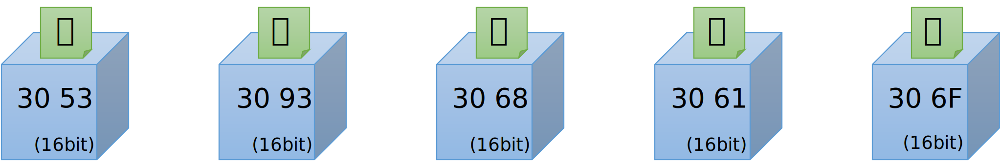

# はじめに


本回では、Unicode のエンコーディングについて説明しています。

# Unicode
Unicode は符号化文字集合や文字符号化方式などを定めた業界規格です。
Unicode は符号化文字集合の規格でもあり、符号化方式（CEF, CES）の規格でもあります。 
世界中の文字を単一の文字集合（文字セット）として扱っているいるところが特徴です。

## コードポイントの構造
Unicode のコードポイントの構造を簡単に押さえておくと、次章以降のエンコーディングの話が理解しやすくなりますので少し触れておきます。
Unicodeのコードポイントは 21bit で表現されます。具体的な範囲は 0x0 - 0x10FFFF になります。
また、各ビットは、次の図のように「面」「区」「点」に分解されます。 


※念の為に補足しますが、これは「コードポイント」なので、計算機上のデータ値ではありません。

## コードポイントの範囲と文字種
Unicodeでは各面ごとに、登録されている文字種がおおむね決まっています。

その中で、第０面のことを基本多言語面（BMP）といい、基本的な文字のほとんどが第０面に収まっています。
第０面は 16bit で表現できる範囲であり、ほとんどの文字は16bitで表現可能です。
しかし、その後、基本多言語面だけでは文字の数が不足することが分かり、
後からさらに 16 面が追加されました(0x01 - 0x10)。16面を表現するのに、Unicode に 5bit が追加され、Unicodeのコードポイントは、21bit に拡張されました。

以下に各面にどんな文字種が収められているのかを簡単に表にしています（出展：Wikipedia）


## 文字符号化形式
 - 文字符号化形式とは、つまりメモリをメモリ上に表現する為の形式の事です。

ここでは、具体的に Unicode を計算機上（メモリ上）のデータ型にエンコードする方法についてみていきます。ここでは "こんにちは" という文字列をエンコードしてみます。
最初に "こんにちは" のコードポイントを示しておきます


※U+XXXX (Xの部分は16進の数字）という表現は Unicode のコードポイントを表す

### UTF-32
Unicode （のコードポイント）を DWORD(32bit) の箱にエンコードする方式です。
C/C++ の型で言えば long (32bit) 型の配列で Unicode 文字列を表現する方法ですね。
32bit は 21bit の Unicode を格納するのに十分な大きさですから、特に難しい変換は行いません。
コードポイントの数字がそのまま DWORD の箱に収まります。


※ 数字は16進数です

UTF-32 は Unicode の文字をすべて表現できる範囲をもつので、一番、シンプルなエンコード方式といえます。
しかし問題もあります。
それはたった一文字を表現するのに 32bit (4バイト) も使う必要があるからです。
特に英語圏の人々からみれば、自分たちが使う字は 8bit もあれば十分なのに 32bit も使用するなんて過剰に思えるでしょう。
そこで UTF-32 以外にもいくつかのエンコード方式が用意されています。

### UTF-16
Unicode （のコードポイント）を WORD(16bit) の箱にエンコードする方式です。
C/C++ の型で言えば short (16bit) 型の配列で Uncode 文字列を表現する方法です。先ほどと同じようにエンコードしてみます。



※ 数字は16進数です

箱の大きさが WORD(16bit) サイズになっただけで、UTF-32 と変わらないですね。
実は、日本語で扱う文字はそのほとんどが 16bit で表現できる範囲に収まっています。
なので多くの場合は変換に特別なルールは必要ありません。
ただし Unicode は 21bit (0x0 - 0x10FFFF) の範囲で定義されていますから、中には WORD (16bit) の箱に収まらない文字が存在します。
絵文字や、一部の外国の文字、あるいは一部の漢字です。
UTF-16 には、それらの文字をエンコードするための特別なルールが用意されています。
それが次に説明するサロゲートペアです。

#### サロゲートペア
サロゲートペアによって、コードポイント値が 16bit に収まらない範囲にある Unicode 文字を UTF-16 で表現することができます。
「ペア」という言葉からわかるように、二つの箱で一文字を表現します。
なお、サロゲートペアのうち先行する箱をハイサロゲート、後続する箱をローサロゲートとよびます。
具体的にサロゲートペアで表現される文字の例をいくつかみてみます。


#### サロゲートペアのエンコード方法
サロゲートペアの領域にあたる文字は、具体的には U+10000 ～ U+10FFFF の範囲にコードポイントを持つ文字です。
つまり第1面から第16面ですね。これらのコードポイントを、UTF-16 の箱２つで表現できるようにエンコードする必要があります。
この変換は次のルールで行います。

《 変換概要 》

U+10000 ～ U+10FFFF の範囲にあるコードポイントを重複の無い 16bit の箱２つに変換する。

《 STEP1 》
 
 まずコードポイントを第10bitの位置で２分割します。
コードポイントは、全体で 21bit で奇数なので、丁度半分にはできないので、とりあえず上位11bitと下位10bitに分解します。


《 STEP2 》
 
ここで上位 11bit を 10bit に圧縮する方法を考えます。<br/>
後述するように、上位ビットと下位ビットをサロゲートコードポイント(後述)の範囲に収める為に、それぞれ 10bit にする必要があります。
下位ビットはすでに 10bit ですが、上位ビットは 11bit です。上位 11bit を詳しくみると、面を表す 5bit と区点を表す 6bit に分かれます。
ここで、10bit に収める為に、面を 4bit で表現できないか考えます。

面(plane)は第0面から第16面あるので全部で17面あります。この為、面をすべて表現するには、最低限 5bit 必要です。
しかし、第０面はサロゲートペアにする必要がないので、サロゲートペアに変換する必要がある面は、第1面から第16面だけです。
つまり全部で16面を表現できればよく、4bit で表現可能です。
そこで面(plane) の範囲を 0x00xxxx - 0x0Fxxxx に収まるようにする為に、コードポイント値から 0x10000 を引きます。
結果、面(plane)が 4bit の範囲に収まることとなり、上位も下位も 10bit で揃います。


《 STEP3 》
 
最後に、ハイサロゲート、および、ローサロゲートを、それぞれ以下の範囲に収まるように調整(シフト)します。
 
  - ハイサロゲート ( 0xD800～0xDBFF )
  - ローサロゲート ( 0xDC00～0xDFFF )

具体的な方法は次の疑似コードを確認してください。なお、0xD800 ～ 0xDBFF の範囲のコードポイントを「サロゲートコードポイント」と呼びます（後述）

#### サロゲートペアのエンコードの疑似コード

《 エンコード方法 》

上述のルールを整理して、エンコードを C/C++ の疑似コードで表すと以下のようになります。

``` c
// 変換対象のコードポイント
int codePoint = 0xXXXXXX
// ハイサロゲートを求める
int hi = ((codePoint - 0x10000) >> 10) + 0xD800;
// ローサロゲートを求める
int lo = (codePoint & 0x3FF) + 0xDC00
```

《 デコード方法 》

上述のルールを整理して、デコードを C/C++ の疑似コードで表すと以下のようになります。

``` c
int codePoint =  (((hi - 0xD800) << 10) + 0x10000) | (lo - 0xDC00);
```

#### サロゲートコードポイント（代用符号位置）
Unicode コードポイントのうち、U+0000 ～ U+FFFF の範囲には、よく使用する基本的な文字や記号が収録されていて、この範囲のことを第０面（基本多言語面）と呼びます。第０面には、いわゆるASCII文字やひらがな、カタカナ、日本でよく使う漢字などの文字が割当てられておりますが、一部、文字ではなく、特殊な用途向けに割り当てられている範囲があり、その一つが、サロゲートコードポイントと呼ばれます。

サロゲートペアの、ハイサロゲートとローサロゲートは、0xD800 ～ 0xDFFFの範囲にありますが、まさにこの範囲がサロゲートコードポイントになります。
この範囲のコードポイントには他の文字が登録されていません。これは、その文字がサロゲートペアか否かの判断が容易になるメリットがあります。 UTF-16 の文字の配列をプログラムから扱っている時に、もしサロゲートコードポイントの範囲の値を見つけたら（前後の文字を調べる必要なく）それは二箱で一文字であると即座に見分けることができます。

### UTF-8
Unicode （のコードポイント）を BYTE(8bit) の箱にエンコードする方式です。
C/C++ の型で言えば char (8bit) 型の配列で Uncode 文字列を表現する方法です。
先程と同じように "こんにちは" という文字列をエンコードしてみます。


数字は16進数です。なお、この例では、どの文字も３バイトに変換されていますが、すべての日本語文字が３バイトになるわけではありません。以下に説明するように、文字によってバイト数が変わるのも UTF-8 の特徴です。

#### UTF-8 の変換方法
変換ルールは以下のようになります。

 - ルール１：0x00-0x7f の範囲にある文字(ASCII)は変換なし。なお、かならず先頭ビットは 0 になる。
 - ルール２：0x80 以降の範囲にある文字は、２バイトから４バイトに変換する
 - ルール３：マルチバイト文字の第１バイト目は、その文字のバイト数を表す。具体的には、１バイト目を２進数で表記したときに、先頭からの 1 の個数でその文字のバイト数を表す。
 
   | 110x xxxx の場合は２バイト文字 | 
   | 1110 xxxx の場合は３バイト文字 |
   | 1111 0xxx の場合は４バイト文字 |

 - ルール４：マルチバイト文字の 2 バイト目以降のバイトは、必ず 10 から始まる
 - ルール５：残りの有効ビット(表の x で表されるビット)で、コードポイントを格納する。コードポイントのビットパターンをそのまま左詰めで格納する
 - ルール６：符号化は最少のバイト数で表現しなければならない。この為、バイト数ごとにコードポイントの範囲（最小値）が定められている。つまり、やろうと思えば １ バイトの ASCII 文字を無理やり 4バイトに変換することも可能だが、これは禁止されているという意味。

以上を表にまとめると以下のようになります。


#### ５バイトを超える表現

UTF-8 のエンコードのルールでは、5バイトや6バイトで文字を表現する形式も原理上は可能ですが、Unicode のコードポイントは21bit と定められていますので、５バイト以上のパターンは利用しません。
過去には Unicode に含まれない文字を表現するのに使用する規格が存在しましたが、現在では不正とみなされるそうです。

また、0xFE(11111110), 0xFF(111111110) は BOM マーク（後述）として利用することが規定されています（つまり、予約されている）。
この為、7バイトや8バイトを表現する方法はありません。

#### サロゲートペアと各エンコーディング間の変換

サロゲートペアは UTF-16 にエンコードする場合にのみ必要な概念です。
UTF-32 と UTF-8 の場合はサロゲートペアの考え方はありません。
UTF-32 は一つの箱で一文字を表すことができるのでそもそもペアにする必要がなく、また、UTF-8 はその仕組み上、もともと複数の箱で一文字を表す仕組みなので、16bit を超える範囲のコードポイントも、他の文字と全く同じルールでエンコードすることができます。

ここで、UTF-16 から UTF-8 や UTF-32 へ変換する場合は、UTF-16 を、一度、コードポイントに戻してから変換する必要があることに注意してください。
サロゲートペア以外の文字についてはコードポイントに戻さなくても結果は同じになりますが、サロゲートペアについては、一度、コードポイントに戻してから変換しないと違う値になってしまいます。
なお、サロゲートペアから直接 UTF-16, UTF-8 の並びに変換したものは不正なデータであるとみなされます。

## 文字符号化スキーム
 - 文字符号化スキームとは、文字列をファイルに保存する時や、ネットワークを伝送させる時のデータ表現の事です

前章で記載の文字符号化形式は、計算機のメモリ上の表現に Unicode のコードポイントをエンコードするルールですが、計算機のメモリ上のレイアウト詳細がどうなっているかは気にしていません。
具体的にいうと、計算機のメモリは CPU の種類によってビッグエンディアンとリトルエンディアンという違いがありますが、これらの違い、つまりメモリの構造はプログラムからは通常は意識する必要がないので規格上も定義されていません。
しかし、意識しなければならない状況もあります。ファイルに文字列を格納する場合やネットワークに文字列を流す場合には、必ず BYTE(8bit) の配列にする必要があるので、この違いを気にしなければなりません。
そこで BYTE(8bit) の配列にエンコードする仕様として、次に記載するエンコーディングが定義されています。

### UTF-32LE, UTF-32BE, (UTF-32)
前述した UTF-32 のルールに従ってコードポイントを変換したあと、UTF-32LE はリトルエンディアン形式で、UTF-32BE はビックエンディアン形式で並べる（直列化する）だけです。
具体例は以下のようになります。また LE や BE がつけずに、UTF-32 と表記する場合もありますが、これは、単に明示していないだけで、実際には必ずリトルエンディアンかビッグエンディアンのいずれかになります。
プログラムからは後述する BOM で並びを判断します。

#### UTF-32BE


#### UTF-32LE


※ 数字は16進数です

### UTF-16LE, UTF-16BE, (UTF16)

前述した UTF-16 のルールに従ってコードポイントを変換したあと、UTF-16LE はリトルエンディアン形式で、UTF-16BE はビックエンディアン形式で並べる（直列化）だけです。
具体例は以下のようになります。
また LE や BE をつけずに、UTF-16 と表記する場合もありますが、これは、単に明示していないだけで、中身はリトルエンディアンかビッグエンディアンのいずれかになります。
プログラムからは後述する BOM で並びを判断します。

#### UTF-16BE


#### UTF-16LE


※ 数字は16進数です

### UTF-8
UTF-8 は 元々 8 Byte の並びなので特に変換する事なくそのままBYTEの配列にエンコードするだけです。
この為、概念上は UTF-8 も文字符号化形式と文字符号化スキームを区別しますが、両者の実態は全く同じものになります。
変換方法については自明なので説明は省略します。

### バイトオーダーマーク(BOM)
バイトオーダーマークは、ファイルやネットワーク伝送において、文字列をバイト単位で処理するときに、
その文字列がビッグエンディアンの並びなのかリトルエンディアンの並びなのかを判別するために用いられる2～4バイトのバイト列です。バイトの並びだけではなく文字符号化方式の判定にも利用されます。

 | 文字符号化方式 | エンディアン | BOM         | 備考                                |
 |----------------|--------------|-------------|-------------------------------------|
 | UTF-8          | N/A          | EF BB BF    | U+EFEE を UTF-8 で表現した 3 バイト |
 | UTF-16 (BE)    | BIG          | FE FF       | 2 バイト                            |
 | UTF-16 (LE)    | LITTLE       | FF FE       | 2 バイト                            |
 | UTF-32 (BE)    | BIG          | 00 00 FE FF | 4 バイト                            |
 | UTF-32 (LE)    | LITTLE       | FF FE 00    | 4 バイト                            |

BOM は、通常はファイルの先頭等に置かれ、プログラムがエンコーディングを判断する為に使用されます。
しかし、別のプロパティ等で明示的に charset=UTF-16LE の様にエンディアンまで指定されている場合には、
プログラムはエンコーディングを推測する必要がないので BOM を使用する必要はありません。

## その他の話題
この記事で触れられていない Unicode 回りのその他のキーワードについて、興味のある方は調べてください
 - Glapheme Cluster - 複数のコードポイントで構成されるけど、人にとっては一文字 
 - SVS (Standardized Variation Sequence/Selector) / IVS (Ideographic Variation Sequence/Selector) - 同じ文字だけど字形が違うパターンの表現
 - Bi-Directional Text - 左から右へ書く
 
 


