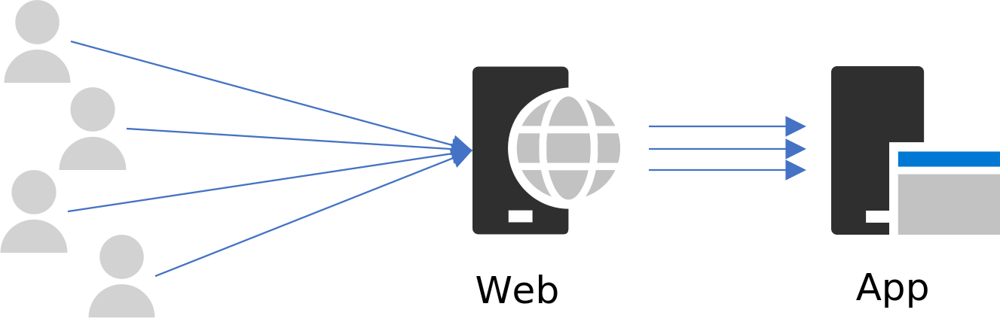

# はじめに
この記事では、プログラマ向けに、以下の二つの疑問のヒントを提供できればと思い記載しています

 - C# (.NET) でプログラミングする時に使う Dispose メソッドってなに(GC との関係は)
 - C# (.NET) の HttpClient の様に、Disposable なのに不用意に Dispose できないオブジェクトがあるのは何故か？

いろんな方がこの話題を取り挙げているので、内容をご存知の方も多いと思いますが、
本記事では「何故」の部分を少し深掘りしてみたいと思います。

なお、ここでは C# (.NET) を例に説明していますが、他の言語や環境でも全く同じ議論が成立しますので、
普段他の言語を利用している方にも参考になると思います。

# GC とリソースの解放

C# や Java をはじめ、Garbage Collection (以降 GC) の機能を備えたプログラミング言語は、
プログラマが自分でオブジェクトの解放しなくて済み、メモリリーク等のバグの発生を低減させてくれる素晴しい機能です。
しかし、確かに GC は便利だけれど、タイミングをプログラマが制御できない難点があります。
呼び出すタイミングをプログラマが制御できないという事は、特に共有リソースの解放のタイミイングを制御できない点で問題になります。

## リソースの即時解放が重要

「リソース」とはメモリやネットワーク接続、ファイルディスクリプタなどの OS や PC の資源を指します。
クライアント環境は、一人のユーザーが PC のリソースを占有できるので、問題が発生しずらいのですが(全く発生しない訳ではない)、
サーバー環境では一つの計算機の資源を複数のスレッド(≒ユーザー)で同時使用しますので、
誰かが共有リソースを掴んでいると、他の人が使えないという状態が発生しやすい環境です。

例えばある、スレッドが大きいメモリを確保すると、その分、他のスレッドが利用可能なメモリ領域が減ります。
そして、そのスレッドがメモリを解放するのを怠り、他のスレッドが次々に大きいメモリを連続で確保しようとすると
当然ながら、何処かのタイミングでメモリが確保できなくなる可能性があるのはすぐ想像できますね。

この為、リソースの利用を終えたスレッドは *即時にリソースを解放* して、他のスレッドが再利用できるようにする事がとても重要になります。
GC は、いつかはリソースの解放をしてくれますが、タイミングは GC のアルゴリズム次第です。
最悪の場合は、そのプロセスが終了するタイミングまでリソースの解放が行なわれないかもしれません。
特にサーバーアプリケーションの場合は、複数のスレッドがリソースを共有していますので、利用が済んだら即時にリソースを解放して、他のスレッドが利用できるようにするのが重要になります。

## リソースの解放のタイミングを制御する

ここまで説明すれば結論は見えますね。
Disposable なオブジェクトは、多くの場合、OS や PC の共有リソースを扱うオブジェクトです。
利用が終了したら即時に Dispose メソッドを呼び出してリソースの解放を行なう必要があるオブジェクトです。
Dipspose メソッドを明示的に呼び出す事で、リソースの解放をタイミングを制御します。

もちろん、即時解放は必要がなくて GC での回収を待てるオブジェクトは、敢て Disposable にする必要はありません。

# ネットワークリソースの解放

アプリ開発において「リソースは使用が終わったら即時解放する」というのが鉄則えす。ネットワーク接続についてはもう少し考慮が必要です。
実は、ネットワーク接続は、通信が終わってプログラムから接続をクローズしても、直ぐに再利用できません。
再利用可能になるまでに数分のタイムラグが存在します。これが問題となる場合があります。

## 高スループットのサーバーでは致命的

今、以下のアーキテクチャの Web システムで、Web サーバーは、バックエンドの App サーバーの Web API を一秒間に数百件以上のペースで呼び出していると仮定します。

 

 

いま、Web サーバーは高スループットでリクエストを処理しているとして、一秒間に数十〜数百回のネットワーク接続のオープンとクローズが繰替えしているとすると何が起るでしょうか。
ここで、以下の 2 つの事実を思い出してください。

- ネットワーク接続をクローズしてから実際に再利用可能になるまでに数分のタイムラグがある
- 同時に利用可能なネットワーク接続の数には限りがある

仮に、一秒間に 100 件のリクエストを処理している状況だと、1 分間で 6000 個のネットワーク接続が新たに必要です。
また、接続リソースが再利用可能になるまでのタイムラグを 4 分だとすると、このペースでリクエストを処理し続ける場合、最低限 24000 個のネットワーク接続が必要になります。

既定では、Windows Server では、約 16000 個のネットワーク接続が利用できますが、

# 参考
## ポート枯渇
## SNAT
## データベース接続

## クライアントにおける Dispose

ここまではサーバー上でのリソース解放を前提にしていました。では、クライアント PC 上のアプリならリソースの解放は怠っても良いかというとそういう訳ではありません。
クライアント PC では、一人のユーザーが PC のリソースを一人で使用しておりますので、サーバー上ほどリソース枯渇の問題は発生し難い環境ではありますが、
しかし、リソースを掴んでいれば他のアプリやスレッドが利用できないのは同じですので、可能な限りすみやかにリソースの解放を行いましょう。

# GC と Disposable

本題に入るまえに「GC と Disposable」についておさらいしましょう。

## GC と、その問題点

C# や Java をはじめ、Garbage Collection (以降 GC) の機能を備えたプログラミング言語は、
プログラマが自分でオブジェクトを解放しなくて済み、メモリリーク等のバグの発生を低減させてくれる素晴しい機能です。
しかし、確かに GC は便利だけれど、タイミングをプログラマが制御できない点は注意が必要になります。
呼び出すタイミングをプログラマが制御できないという事は、特に共有リソースの解放のタイミイングを制御できない点で問題になります。

## リソースには限りがある

「リソース」とはメモリやネットワーク接続、ファイルディスクリプタなどの OS やハードウエアの資源を指します。
ユーザー一人が PC を占有できるクライアント環境と違い、サーバー環境の場合は、一つのサーバーのリソースを複数のスレッド(≒ユーザー)で同時使用しますので、
誰かがリソースを掴んだまま離さないでいると、他の人が使えないという問題が発生しやすい環境です。

例えばあるスレッドが、大きいメモリを確保すると、他のスレッドが利用可能なメモリ領域が減ります。
そして、それぞれのスレッドがメモリを解放する事を怠り、他のスレッドが次々に大きいメモリを連続で確保しようとすると
当然ながら、リソースには限りがありますので、何処かのタイミングでメモリが確保できなくなる可能性があるのはすぐ想像できますね。

## リソースの即時解放が重要

この為、リソースの利用を終えたスレッドは *即時にリソースを解放* して、他のスレッドが再利用できるようにする事がとても重要になります。
ところが GC は、いつかはリソースの解放をしてくれますが、タイミングは GC のアルゴリズム次第なので、いつ解放するか解りません。
最悪の場合は、そのプロセスが終了するタイミングまでリソースの解放が行なわれないかもしれません。
クライアント環境では、解放が遅れても問題なく動作してしまうかもしれませんが、サーバー環境の場合は、
多くのスレッドが同時並行でリソースを共有しますので、問題が発生する可能性があります。
最悪の場合、パフォーマンスが低下したりリソース不足エラーが発生する可能性が高くなります。
つまり、特にサーバー環境のアプリケーションでは、共有リソースの利用が済んだら直ちにリソースを解放して、
他のスレッドが利用できるようにするのが基本なのです。

## リソースの解放のタイミングを制御する

ここまで説明すれば、Disposable の役割がお解りかと思います。
Disposable なオブジェクトは、多くの場合、OS やハードウエアの共有リソースを扱うオブジェクトであり、
利用が終了したら即時に Dispose メソッドを呼び出してリソースの即時解放を行なう必要があるオブジェクトです。
Disposable なオブジェクトの Dipspose メソッドをプログラムから明示的に呼びだす事でリソースの解放を行ないます。
これにより、GC に頼ることなく Disposable なオブジェクトの解放タイミングをプログラムから制御する事ができます。

# 

これまで説明したとおり、Disposable なオブジェクトは、
通常 OS やハードウエア等の共有リソースを扱うオブジェクトなので、
使い終わったら即時解放が基本です。この考え方は間違っていません。

ところがです。即時解放を行なうと都合が悪いオブジェクトが存在します。

## リソースの即時解放ができないオブジェクト

Dispose メソッドを呼びだす事は、プログラム(スレッド)が OS に対して「ぼく、使い終わったからリソースを返すね」といって OS にリソースを返却する事を意味します。
他のプログラム(スレッド)が再利用できるように、本当の意味でリソースの解放を行なうのは OS の担当です。

殆どの場合は、プログラム(スレッド)からリソースの解放を行なえば、OS は直ちにリソースを解放するのですが、
*直ぐに解放できない* オブジェクトがあります。

HttpClient 等のネットワーク通信に関するオブジェクトは、プログラムから Dispose を呼び出しても
実際に他のプログラム(スレッド)から再利用できるようになるまでには、

